# Temporal-Network-Analysis

This project reproduces and visualizes ideas from the paper "Community Detection in Weighted Time-Variant Social Network". It analyzes a high school contact network over 5 days using the Louvain community detection algorithm.

## 🎥 Louvain Algorithm Visualization

A dynamic visualization of the Louvain algorithm optimizing modularity on a sample network. The animation shows nodes moving between communities to maximize the modularity score.

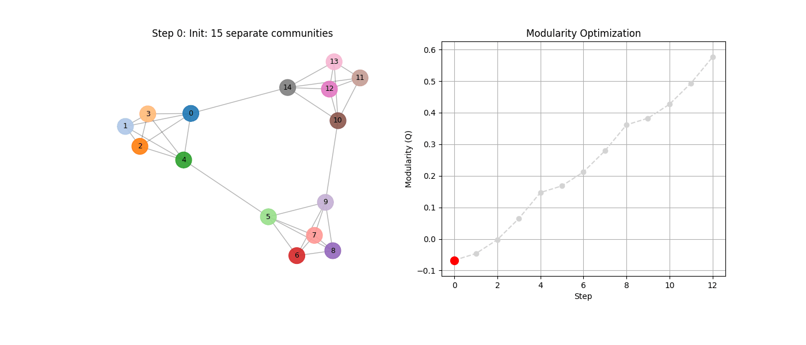

## 🕸️ Network Visualizations

### Aggregated Network (All Days)
The complete contact network aggregated over the 5-day period.
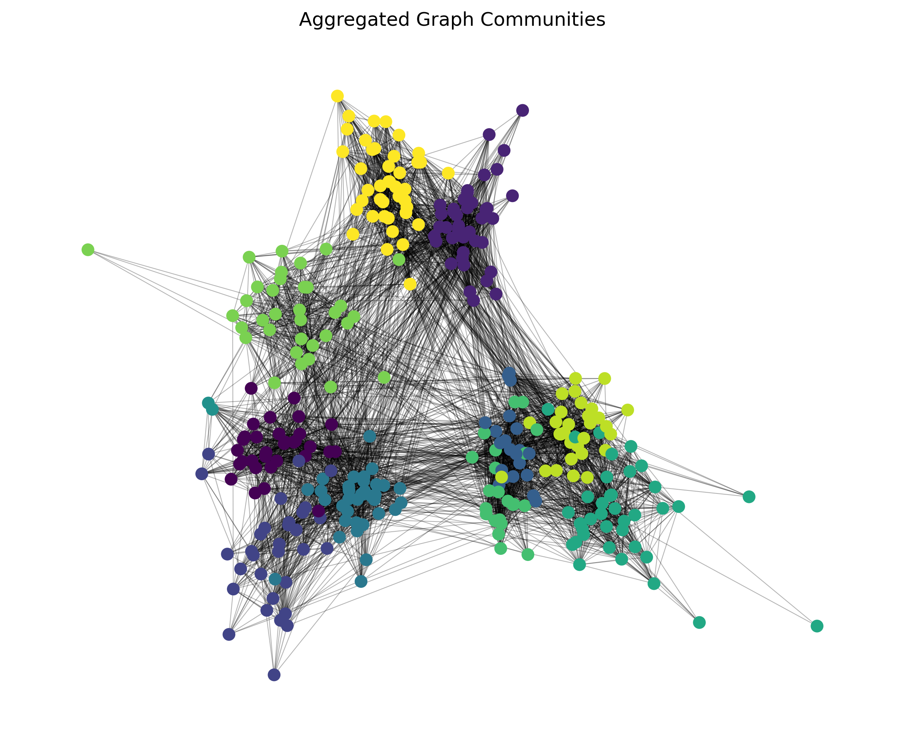

### Daily Snapshots
Evolution of the contact network and community structures day by day.

| Day 1 | Day 2 | Day 3 |
|:---:|:---:|:---:|
| 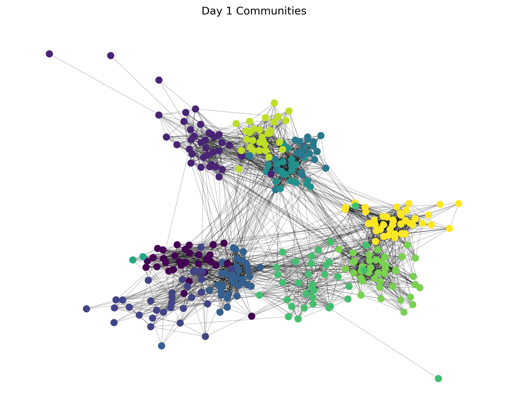 | 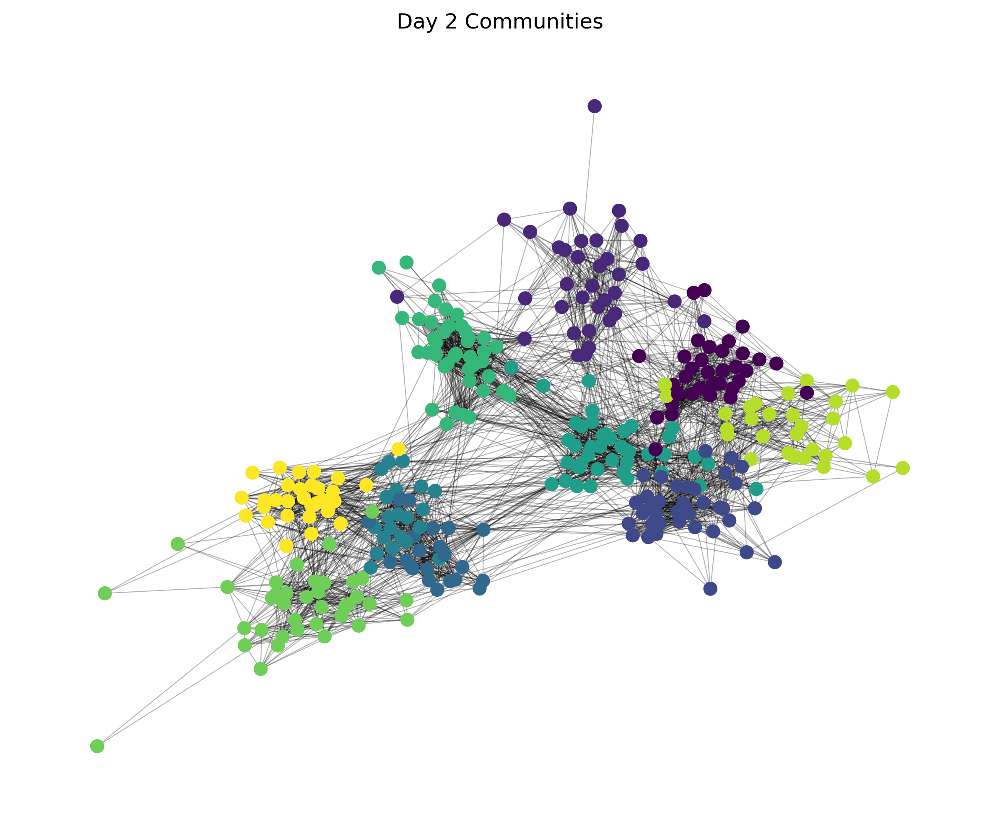 | 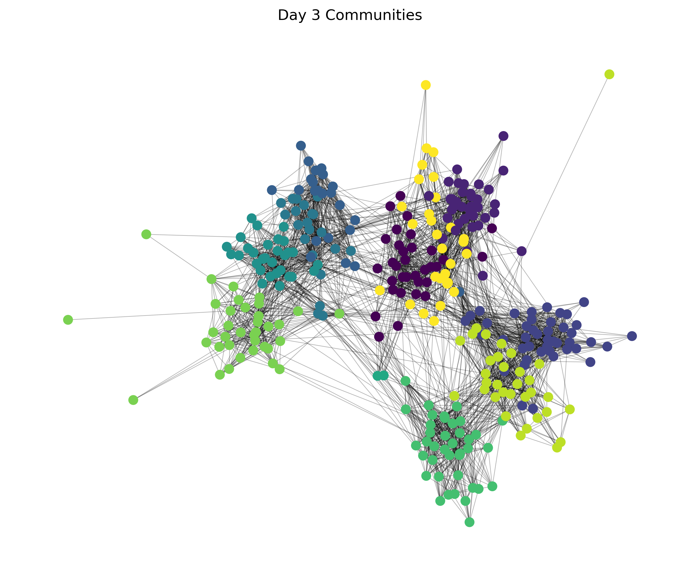 |

| Day 4 | Day 5 |
|:---:|:---:|
| 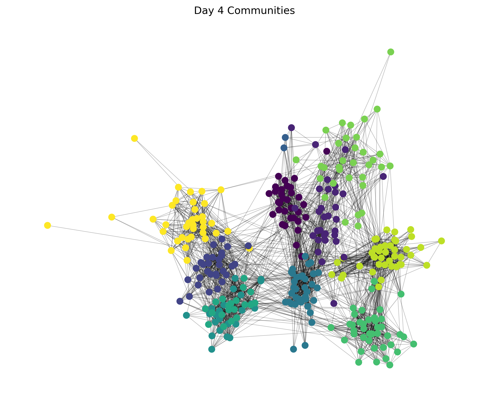 | 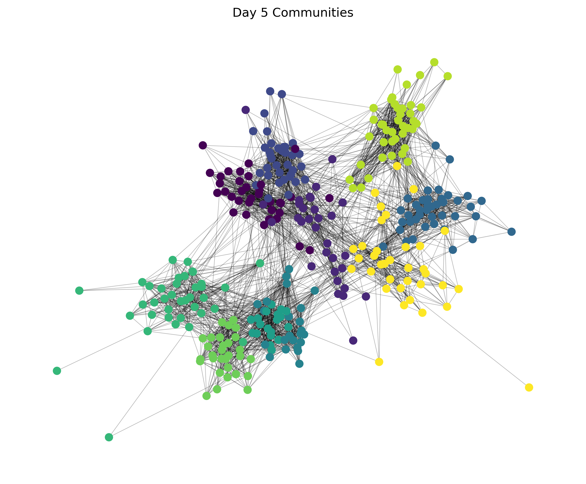 |

## 📊 Analysis & Metrics

### Evolution of Network Metrics
Tracking key metrics such as Modularity, Number of Communities, and Average Path Length over the 5 days.

| Modularity | Number of Communities |
|:---:|:---:|
| 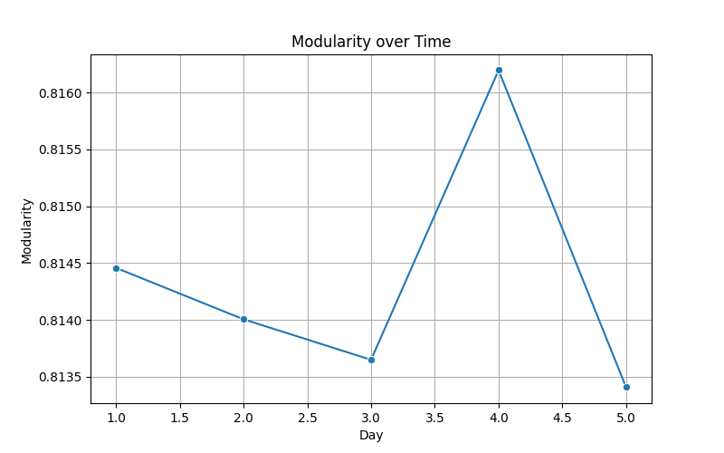 | 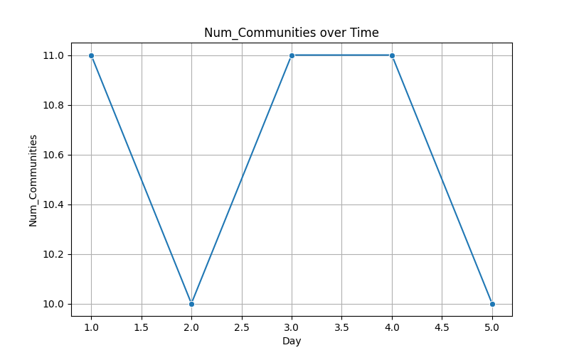 |

| Avg Path Length | Avg Clustering Coeff |
|:---:|:---:|
| 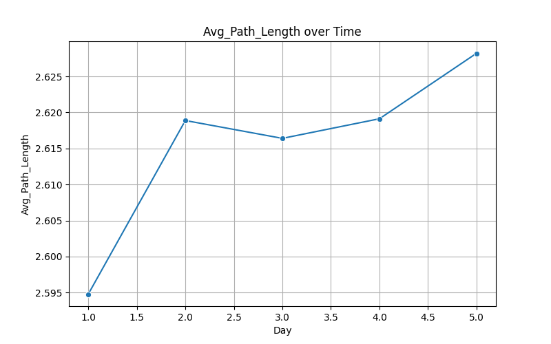 | 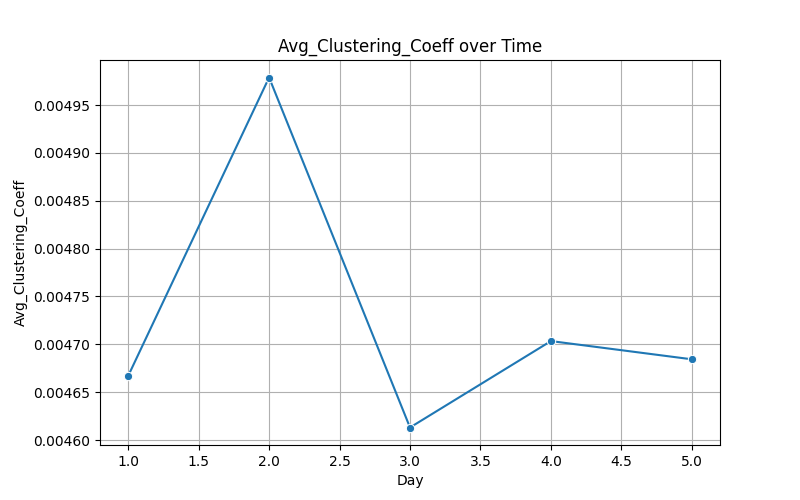 |

### Correlation Matrix
Correlation between different network metrics.
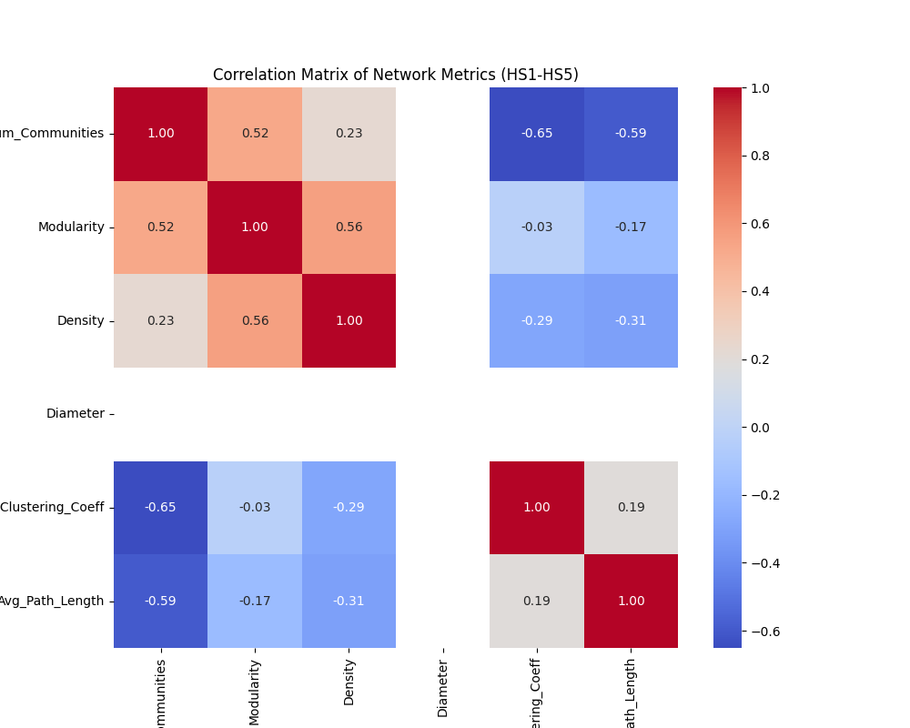

## Project Structure

- `src/`: Source code modules.
  - `data_loading.py`: Loading and splitting dataset.
  - `graphs.py`: Building NetworkX graphs.
  - `community_detection.py`: Louvain algorithm wrapper.
  - `metrics.py`: Network statistics computation.
  - `visualization.py`: Plotting functions.
- `data/`: Input data directory.
- `output/`: Generated plots and statistics.
- `main.py`: Main execution script.

## Setup

1. Install dependencies:
   ```bash
   pip install -r requirements.txt
   ```

2. Data:
   - Place your `high_school_contacts.csv` in the `data/` folder.
   - It must have columns: `source`, `target`, `day`.
   - If no file is found, the script generates dummy data automatically.

## Usage

Run the main script:

```bash
python main.py
```

## Outputs

The script produces:
- `output/HS1.png` to `HS5.png`: Daily graph visualizations colored by community.
- `output/HS0.png`: Aggregated graph visualization.
- `output/network_statistics.csv`: Table of metrics (Modularity, Density, etc.).
- `output/metric_*.png`: Plots of metrics over time.
- `output/correlation_matrix.png`: Correlation heatmap of metrics.
- `output/louvain_didactic.png`: Explanatory visualization of the Louvain method.
